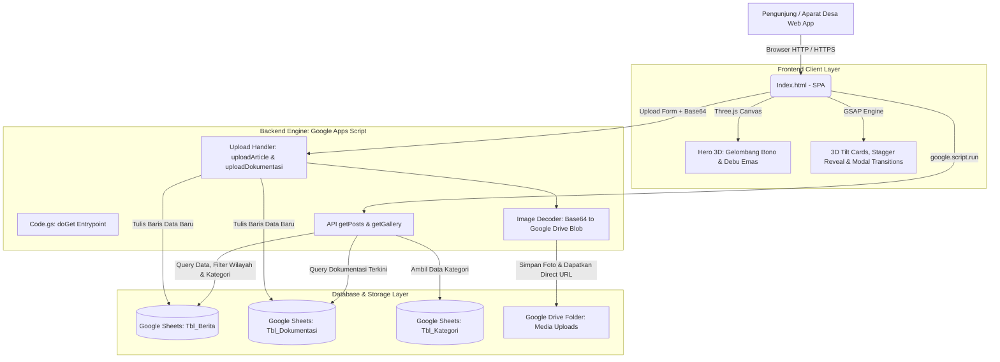

# 🌾 Lancang Kuning Digital: Portal Agregator Berita & Dokumentasi Desa Se-Provinsi Riau

Website agregator warta, inovasi desa, pemberdayaan BUMDes, kearifan lokal Melayu, dan dokumentasi kegiatan desa se-Provinsi Riau yang modern, berkelas (*luxury emerald & royal gold*), 100% responsif, serta terintegrasi langsung dengan ekosistem **Google Apps Script (GAS)**, **Google Sheets**, dan **Google Drive**.

---

## 🏛️ Arsitektur Sistem & Alur Data



---

## 📂 Struktur Berkas Proyek

| Berkas | Peran & Deskripsi |
|---|---|
| [Setup.gs](file:///c:/laragon/www/Web-Desa/Setup.gs) | Script inisialisasi awal database Google Sheets (`Tbl_Admin`, `Tbl_Berita`, `Tbl_Dokumentasi`, `Tbl_Kategori`), pewarnaan header *Emerald Luxury*, pengisian data dummy realistis desa se-Riau, serta pembuatan folder Google Drive. |
| [Code.gs](file:///c:/laragon/www/Web-Desa/Code.gs) | Backend controller, routing `doGet(e)` (publik & `?page=admin`), autentikasi admin database Sheets, CRUD API publik, dan API moderasi admin (Approve, Edit, Reject, Delete). |
| [Admin.html](file:///c:/laragon/www/Web-Desa/Admin.html) | Panel Administrator mandiri dengan login gate, ringkasan metrik pending review, tabel moderasi warta desa, moderasi dokumentasi foto, dan pembuatan warta resmi. |
| [Index.html](file:///c:/laragon/www/Web-Desa/Index.html) | Antarmuka publik SPA dengan Three.js 3D Hero (Gelombang Bono), GSAP tilt cards, navigasi 12 Kabupaten/Kota Riau, Reader Modal, Lightbox viewer, dan form setor warta/kegiatan desa yang otomatis berstatus *Pending* menunggu persetujuan admin. |

---

## 📋 Struktur Tabel Database (Google Sheets)

### 1. `Tbl_Admin` (Autentikasi Panel Admin)
| Kolom | Tipe | Contoh Data | Keterangan |
|---|---|---|---|
| `id` | Text | `ADM-001` | ID unik akun admin |
| `username` | Text | `admin_riau` | Username untuk login portal admin |
| `password` | Text | `********` | Password login |
| `nama_lengkap`| Text | `Administrator Utama Provinsi Riau` | Nama penanggung jawab |
| `role` | Text | `Super Admin` | Peran hak akses (*Super Admin* / *Verifikator*) |
| `email` | Text | `admin@portaldesariau.id` | Email admin |
| `status` | Text | `Active` | Status akun (*Active* / *Inactive*) |
| `created_at` | Date | `2026-10-01` | Tanggal pembuatan akun |

> **Akun Admin Bawaan (Default):**
> 1. Username: `admin_riau` | Password: `<PASSWORD_ANDA>` *(Peran: Super Admin)*
> 2. Username: `admin_desa` | Password: `<PASSWORD_ANDA>` *(Peran: Verifikator Desa)*
>
> *Segera ganti password default langsung di sheet `Tbl_Admin` setelah setup.*

---

### 2. `Tbl_Berita`
| Kolom | Tipe | Contoh Data | Keterangan |
|---|---|---|---|
| `id` | Text | `BRT-2026-001` | Primary key unik berita |
| `judul` | Text | `Transformasi Digital Desa Muara Takus` | Judul artikel berita |
| `slug` | Text | `transformasi-digital-desa-muara-takus` | URL-friendly slug |
| `kategori` | Text | `Pemberdayaan Ekonomi` | Kategori warta |
| `desa` | Text | `Desa Muara Takus` | Nama desa asal warta |
| `kabupaten_kota` | Text | `Kampar` | 1 dari 12 Kabupaten/Kota di Riau |
| `konten` | Text (Long) | `Desa Muara Takus di Kecamatan XIII Koto Kampar...` | Isi lengkap narasi |
| `thumbnail_url` | URL | `https://lh3.googleusercontent.com/d/...` | Link langsung foto sampul |
| `tanggal` | Date | `2026-10-01` | Tanggal terbit (YYYY-MM-DD) |
| `status` | Text | `Pending` / `Published` / `Rejected` | Status moderasi (hanya *Published* yang tampil di portal publik) |
| `disetor_oleh` | Text | `Budi (Kaur Keuangan Desa)` | Nama/perangkat desa yang menyetor warta |

### 2. `Tbl_Dokumentasi`
| Kolom | Tipe | Contoh Data | Keterangan |
|---|---|---|---|
| `id` | Text | `DOC-2026-001` | Primary key unik dokumentasi |
| `judul_kegiatan` | Text | `Pelatihan Akuntansi BUMDes Mandiri` | Nama kegiatan lapangan |
| `lokasi_desa` | Text | `Desa Dayun, Siak` | Lokasi desa dan kabupaten |
| `foto_url` | URL | `https://lh3.googleusercontent.com/d/...` | Foto kegiatan resolusi tinggi |
| `deskripsi` | Text | `Workshop tata kelola kas desa digital...` | Deskripsi ringkas kegiatan |
| `tanggal` | Date | `2026-10-01` | Tanggal pelaksanaan |

### 3. `Tbl_Kategori`
| Kolom | Keterangan |
|---|---|
| `id`, `nama_kategori`, `slug`, `deskripsi`, `icon` | Klasifikasi topik desa (Pemberdayaan Ekonomi, Pariwisata & Budaya, Infrastruktur & Digital, Pertanian & Perkebunan, Sosial & Tradisi, Kesehatan & Lingkungan). |

---

## 🚀 Panduan Langkah Demi Langkah Deployment ke Google Apps Script

### Langkah 1: Buat Google Spreadsheet Baru
1. Buka [Google Sheets](https://sheets.new) di browser Anda.
2. Beri nama spreadsheet: `Database Portal Desa Riau`.

### Langkah 2: Buka Google Apps Script Editor
1. Di menu atas Google Sheets, klik **Ekstensi (Extensions)** > **Apps Script**.
2. Beri judul project: `Backend Portal Desa Riau`.

### Langkah 3: Masukkan Kode Proyek
1. **File `Code.gs`**:
   - Ganti seluruh isi `Code.gs` bawaan dengan kode dari file [Code.gs](file:///c:/laragon/www/Web-Desa/Code.gs).
2. **File `Setup.gs`**:
   - Klik tombol **`+`** (Tambah file) di samping menu File, pilih **Script**.
   - Beri nama `Setup`.
   - Tempelkan seluruh kode dari file [Setup.gs](file:///c:/laragon/www/Web-Desa/Setup.gs).
3. **File `Index.html`**:
   - Klik tombol **`+`**, pilih **HTML**.
   - Beri nama `Index` *(pastikan huruf I besar)*.
   - Tempelkan seluruh kode dari file [Index.html](file:///c:/laragon/www/Web-Desa/Index.html).

### Langkah 4: Jalankan Inisialisasi Database (`Setup.gs`)
1. Pada dropdown daftar fungsi di bagian atas editor Apps Script, pilih fungsi **`initialSetupDatabase`**.
2. Klik tombol **Run (Jalankan)**.
3. Google akan meminta otorisasi izin akses (*Review Permissions*):
   - Pilih akun Google Anda.
   - Klik **Advanced (Lanjutan)** > **Go to Backend Portal Desa Riau (unsafe)**.
   - Klik **Allow (Izinkan)**.
4. Buka kembali Google Sheets Anda: tab `Tbl_Berita`, `Tbl_Dokumentasi`, dan `Tbl_Kategori` otomatis terbuat rapi lengkap dengan data dummy awal!
5. Buka tab **Execution log** di Apps Script: catat nilai `Folder ID` dari folder Google Drive yang otomatis dibuat (contoh: `1abcXYZ...`).

### Langkah 5: Hubungkan Folder Drive ke `Code.gs`
1. Buka file `Code.gs` di editor Apps Script.
2. Pada baris konfigurasi atas:
   ```javascript
   const CONFIG = {
     SPREADSHEET_ID: "", // Boleh kosong jika terikat langsung ke Sheets
     DRIVE_FOLDER_ID: "TEMPEL_FOLDER_ID_DISINI", // Tempel ID folder yang didapat dari Langkah 4
     // ...
   };
   ```
3. Tekan **Ctrl + S** untuk menyimpan.

### Langkah 6: Deploy sebagai Web App (Akses: Anyone)
1. Di pojok kanan atas editor Apps Script, klik tombol biru **Deploy** > **New deployment (Penerapan baru)**.
2. Klik ikon gerigi ⚙️ di samping *Select type*, lalu pilih **Web app**.
3. Isi konfigurasi deployment:
   - **Description**: `Versi 1.0 Produksi - Portal Agregator Desa Riau`
   - **Execute as**: **`Me (emailanda@gmail.com)`**
   - **Who has access**: **`Anyone (Siapa saja)`** *(PENTING: Jangan pilih 'Only myself' agar warga & umum dapat mengakses)*.
4. Klik tombol **Deploy**.
5. Salin tautan **Web app URL** yang muncul (format: `https://script.google.com/macros/s/.../exec`).
6. Buka tautan tersebut di browser atau bagikan ke seluruh perangkat desktop maupun smartphone!

---

## 🎨 Fitur Visual & Teknologi Unggulan

1. **Efek 3D Interaktif (Three.js)**:
   - Visualisasi partikel emas dinamis (*Golden Stardust*) yang mensimulasikan gelombang ikonik Riau (*Gelombang Bono Sungai Kampar*).
   - Partikel bergerak lembut dan merespons pergerakan kursor mouse pengguna secara adaptif.
2. **Animasi Halus & 3D Tilt (GSAP)**:
   - Efek 3D tilt pada kartu berita saat kursor melintas (*perspective hover*).
   - Stagger reveal saat memuat berita dan perpindahan filter.
   - Transisi pop-up modal pembaca berita dan formulir upload berbasis *spring physics*.
3. **Palet Warna "Lancang Kuning & Zamrud Khatulistiwa"**:
   - Dominasi warna *Dark Emerald* (`#020d09`, `#051812`) berpadu dengan *Royal Malay Gold* (`#f59e0b`, `#fbbf24`).
   - Tekstur songket Melayu subtle dan sentuhan *glassmorphism* modern dengan *backdrop-blur*.
4. **12 Wilayah Kabupaten / Kota Riau**:
   - Filter instan untuk Bengkalis, Indragiri Hilir, Indragiri Hulu, Kampar, Kepulauan Meranti, Kuantan Singingi, Pelalawan, Rokan Hilir, Rokan Hulu, Siak, Kota Dumai, dan Kota Pekanbaru.
5. **Mode Dual Engine (Lokal & Cloud)**:
   - Berkas `Index.html` dapat dijalankan secara langsung di server lokal Laragon (`c:\laragon\www\Web-Desa\Index.html`) dengan mesin mock otomatis untuk kebutuhan testing/demonstrasi tanpa harus deploy terlebih dahulu.
